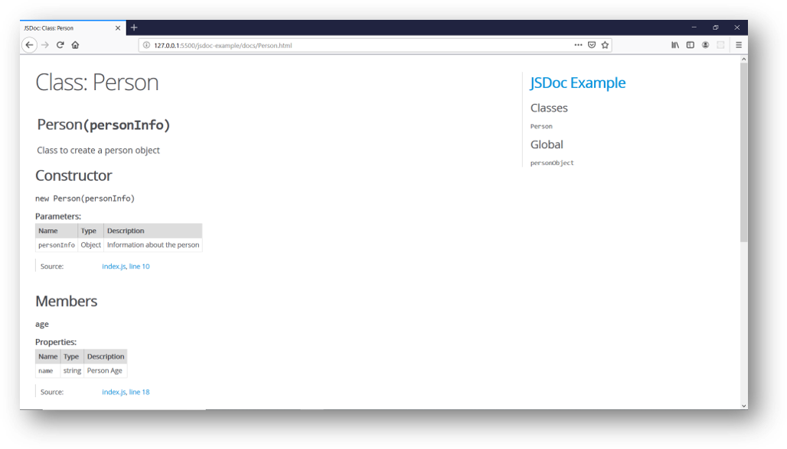

# JSDoc Setup Guide


An API documentation generator for JavaScript.


## Installation and Setup


**Step 01**: 

To install the latest version on npm globally

    npm install -g jsdoc


To install the latest version on npm locally and save it in your package's
`package.json` file:

    npm install --save-dev jsdoc

**Step 02**:

Create a `package.json` file inside jsdoc-example folder using below command

```
    npm init -y
```
```
{
  "name": "jsdoc-example",
  "version": "1.0.0",
  "description": "",
  "main": "index.js",
  "scripts": {
    "doc": "jsdoc -c jsdoc.json"
  },
  "keywords": [],
  "author": "",
  "license": "ISC",
  "devDependencies": {
    "jsdoc": "^3.6.4"
  }
}

```
**Step 03**:  

Create a `jsdoc.json` file inside jsdoc-example folder

```
{
    "source": {
        "include": ["src"],
        "includePattern": ".js$",
        "excludePattern": "(node_modules/|docs)"
    },
    "plugins": ["plugins/markdown"],
    "templates": {
        "cleverLinks": true,
        "monospaceLinks": true
    },
    "opts": {
        "recurse": true,
        "destination": "./docs",
        "template": "./custom-template",
        "tutorials": "./tutorials",
        "readme": "./README.md"
    }
}
```
**Step 04**:

Create a src folder and add the following code

```javascript
/**
 * Class to create a person object
 */
class Person {
  /**
   * 
   * @param {Object} personInfo Information about the person 
   */
  constructor(personInfo) {
      /**
       * @property {string} name Person Name
       */
      this.name = personInfo.name;
      /**
       * @property {string} name Person Age
       */
      this.age = personInfo.age
  }
  
  /**
   * @property {Function} greet A greeting with the name and age
   * @returns void
   */
  greet() {
      console.log(`Hello, my name is ${this.name} and I am ${this.age}`);
  }
}
```
Now run jsdoc in your command line
```
    npm run doc
```
This will create the docs directory which contains the mini-documentation for the Person Class. Open the docs/index.html file in your browser




### Templates

+ [jaguarjs-jsdoc](https://github.com/davidshimjs/jaguarjs-jsdoc)
+ [DocStrap](https://github.com/docstrap/docstrap)
([example](https://docstrap.github.io/docstrap))
+ [jsdoc3Template](https://github.com/DBCDK/jsdoc3Template)
  ([example](https://github.com/danyg/jsdoc3Template/wiki#wiki-screenshots))
+ [minami](https://github.com/Nijikokun/minami)
+ [docdash](https://github.com/clenemt/docdash)
([example](http://clenemt.github.io/docdash/))
+ [tui-jsdoc-template](https://github.com/nhnent/tui.jsdoc-template)
([example](https://nhnent.github.io/tui.jsdoc-template/latest/))
+ [better-docs](https://github.com/SoftwareBrothers/better-docs)
([example](https://softwarebrothers.github.io/admin-bro-dev/index.html))

### Build tools

+ [JSDoc Grunt plugin](https://github.com/krampstudio/grunt-jsdoc)
+ [JSDoc Gulp plugin](https://github.com/mlucool/gulp-jsdoc3)
+ [JSDoc GitHub Action](https://github.com/andstor/jsdoc-action)

### Other tools

+ [jsdoc-to-markdown](https://github.com/jsdoc2md/jsdoc-to-markdown)
+ [Integrating GitBook with
JSDoc](https://medium.com/@kevinast/integrate-gitbook-jsdoc-974be8df6fb3)

## For more information

+ Documentation is available at [jsdoc.app](https://jsdoc.app/).
+ Contribute to the docs at
[jsdoc/jsdoc.github.io](https://github.com/jsdoc/jsdoc.github.io).
+ [Join JSDoc's Slack channel](https://jsdoc-slack.appspot.com/).
+ Ask for help on the
[JSDoc Users mailing list](http://groups.google.com/group/jsdoc-users).
+ Post questions tagged `jsdoc` to
[Stack Overflow](http://stackoverflow.com/questions/tagged/jsdoc).
