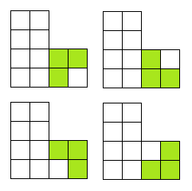
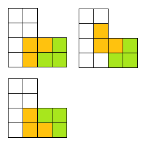
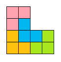
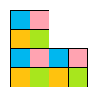
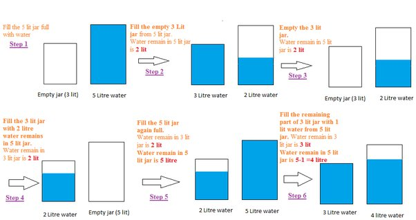

# Puzzles

## Q. There is a room with a door (closed) and three light bulbs. Outside the room there are three switches, connected to the bulbs. You may manipulate the switches as you wish, but once you open the door you can't change them. Identify each switch with its bulb?

Let the bulbs be X, Y and Z

Turn on switch X for 5 to 10 minutes. Turn it off and turn on switch Y. Open the door and touch the light bulb.

1. If the light is on, it is Y
1. If the light is off and hot, it is X
1. If the light is off and cold, it is Z

    <b><a href="#">↥ back to top</a></b>

## Q. There are 4 persons (A, B, C and D) who want to cross a bridge in night

1. A takes 1 minute to cross the bridge.
1. B takes 2 minutes to cross the bridge.
1. C takes 5 minutes to cross the bridge.
1. D takes 8 minutes to cross the bridge.

There is only one torch with them and the bridge cannot be crossed without the torch. There cannot be more than two persons on the bridge at any time, and when two people cross the bridge together, they must move at the slower person’s pace.

Can they all cross the bridge in 15 minutes?

**Solution:**

Step 1: A and B cross the bridge. A comes back. Time taken 3 minutes. Now B is on the other side.
Step 2: C and D cross the bridge. B comes back. Time taken 8 + 2 = 10 minutes. Now C and D are on the other side.
Step 3: A and B cross the bridge. Time taken is 2 minutes. All are on the other side.

Total time spent: 3 + 10 + 2 = 15 minutes.

    <b><a href="#">↥ back to top</a></b>

## Q. How to divide the L shape into 4 equal parts?

The first part is true. First consider the possibilities for positioning the tromino in the lower right corner:

  

The first two obviously don\'t work, the second two lead to:

  

of which only the second has a solution:

  

There is another packing:

  

For connected packings we have that the axis of symmetry for the tromino can be crossed 0, 2 or 4 times. An odd crossing number partitions the tromino into 2 with an odd number of 'polytroms' left over

    <b><a href="#">↥ back to top</a></b>

## Q. If you have a 5-litre jug and a 3-litre jug, how would you measure exactly 4 litres?

**Steps:**

* Fill the 3 L jug and put the water in the 5 Ljug.
* Then fill the 3 L jug again and use it to fill the 5 L jug. You now have 1 L water un the 3 L jug.
* Empty the 5 L jug and put the 1 L water into it.
* Fill the 3 L jug and put that in the 5L jug containing 1 L water.
* You now have 4 L water.

  

    <b><a href="#">↥ back to top</a></b>

