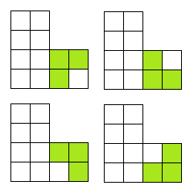
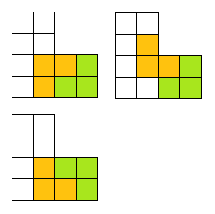
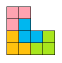
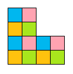
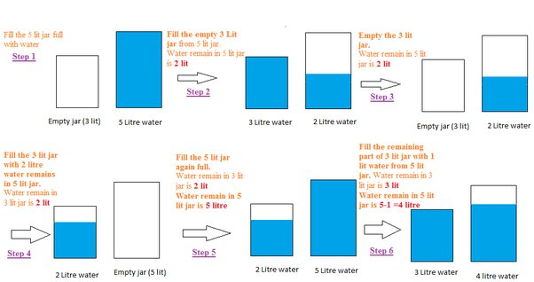

# Puzzles

## Q. There is a room with a door (closed) and three light bulbs. Outside the room there are three switches, connected to the bulbs. You may manipulate the switches as you wish, but once you open the door you can\'t change them. Identify each switch with its bulb?

Let the bulbs be X, Y and Z

Turn on switch X for 5 to 10 minutes. Turn it off and turn on switch Y. Open the door and touch the light bulb.

1. If the light is on, it is Y
1. If the light is off and hot, it is X
1. If the light is off and cold, it is Z

    <b><a href="#">↥ back to top</a></b>

## Q. There are 4 persons (A, B, C and D) who want to cross a bridge in night

1. A takes 1 minute to cross the bridge.
1. B takes 2 minutes to cross the bridge.
1. C takes 5 minutes to cross the bridge.
1. D takes 8 minutes to cross the bridge.

There is only one torch with them and the bridge cannot be crossed without the torch. There cannot be more than two persons on the bridge at any time, and when two people cross the bridge together, they must move at the slower person’s pace.

Can they all cross the bridge in 15 minutes?

**Solution:**

Step 1: A and B cross the bridge. A comes back. Time taken 3 minutes. Now B is on the other side.
Step 2: C and D cross the bridge. B comes back. Time taken 8 + 2 = 10 minutes. Now C and D are on the other side.
Step 3: A and B cross the bridge. Time taken is 2 minutes. All are on the other side.

Total time spent: 3 + 10 + 2 = 15 minutes.

    <b><a href="#">↥ back to top</a></b>

## Q. How to divide the L shape into 4 equal parts?

The first part is true. First consider the possibilities for positioning the tromino in the lower right corner:

  

The first two obviously don\'t work, the second two lead to:

  

of which only the second has a solution:

  

There is another packing:

  

For connected packings we have that the axis of symmetry for the tromino can be crossed 0, 2 or 4 times. An odd crossing number partitions the tromino into 2 with an odd number of 'polytroms' left over

    <b><a href="#">↥ back to top</a></b>

## Q. If you have a 5-litre jug and a 3-litre jug, how would you measure exactly 4 litres?

**Steps:**

* Fill the 3 L jug and put the water in the 5 Ljug.
* Then fill the 3 L jug again and use it to fill the 5 L jug. You now have 1 L water un the 3 L jug.
* Empty the 5 L jug and put the 1 L water into it.
* Fill the 3 L jug and put that in the 5L jug containing 1 L water.
* You now have 4 L water.

  

    <b><a href="#">↥ back to top</a></b>

## Q. You have 9 balls, all identical in appearance. One ball is slightly heavier than the others. Using a balance scale only twice, how do you find the heavy ball?

**Solution:**

**Weighing 1:** Divide the 9 balls into three groups of 3: Group A (balls 1–3), Group B (balls 4–6), Group C (balls 7–9). Place Group A on the left pan and Group B on the right pan.

* **If left side is heavier** → the heavy ball is in Group A (balls 1–3).
* **If right side is heavier** → the heavy ball is in Group B (balls 4–6).
* **If balanced** → the heavy ball is in Group C (balls 7–9).

**Weighing 2:** Take the 3-ball group identified as containing the heavy ball. Place one ball on each pan, leaving one aside.

* **If left is heavier** → that ball is the heavy one.
* **If right is heavier** → that ball is the heavy one.
* **If balanced** → the ball set aside is the heavy one.

**Answer:** The heavy ball is found in exactly **2 weighings**.

    <b><a href="#">↥ back to top</a></b>

## Q. You have two ropes, each of which takes exactly 1 hour to burn. They do not burn at a uniform rate. How do you measure exactly 45 minutes?

**Solution:**

1. **At time 0:** Light Rope 1 from **both ends** simultaneously, and light Rope 2 from **one end**.
2. Rope 1 burns from both ends so it burns out in exactly **30 minutes**.
3. **At 30 minutes** (when Rope 1 is fully burnt): Light the **other end** of Rope 2.
4. Rope 2 had 30 minutes of burning left. Lighting the second end makes it burn twice as fast, so it burns out in **15 more minutes**.
5. **Total: 30 + 15 = 45 minutes.**

    <b><a href="#">↥ back to top</a></b>

## Q. You have 25 horses. You can race 5 horses at a time but have no stopwatch. What is the minimum number of races needed to find the top 3 fastest horses?

**Solution: 7 races**

**Races 1–5 (5 races):** Divide 25 horses into 5 groups of 5 and race each group. Record the winner of each group.

Label the winners W1, W2, W3, W4, W5 (W1 is fastest of its group, etc.).

**Race 6:** Race the 5 group winners against each other. Suppose the result is: W1 > W2 > W3 > W4 > W5.

* W4 and W5 cannot be in the top 3 — eliminate them and their entire groups.
* W1 is definitively the **fastest horse overall**.

**Race 7:** The candidates for 2nd and 3rd place are:
* W2 and W3 (from Race 6)
* The horse that came 2nd in W1\'s group (could be faster than W2)
* The horse that came 3rd in W1\'s group
* The horse that came 2nd in W2\'s group

Race these **5 horses**. The top 2 finishers are 2nd and 3rd overall.

**Answer: 7 races minimum.**

    <b><a href="#">↥ back to top</a></b>

## Q. A man lives on the 10th floor of a building. Every day he takes the elevator down to the ground floor to go to work. When he returns, he takes the elevator to the 7th floor and then walks up the stairs to the 10th floor. Why?

**Solution:**

The man is **too short** to reach the button for the 10th floor. He can only reach up to the 7th floor button. In the morning, going down, he presses the ground floor button which is at the bottom — within reach. In the evening, he can only reach as high as floor 7, so he rides to 7 and walks the remaining 3 floors.

**Exception:** On rainy days he uses his umbrella to press the 10th floor button.

> This is a classic **lateral thinking puzzle** testing whether candidates can think beyond obvious assumptions.

    <b><a href="#">↥ back to top</a></b>

## Q. You are in a room with two doors. One door leads to freedom, the other to death. There are two guards — one always tells the truth, the other always lies. You can ask only ONE question to ONE guard. What do you ask?

**Solution:**

Ask either guard: **"If I asked the other guard which door leads to freedom, what would they say?"**

* If you ask the **truth-teller**: They know the liar would point to the wrong door, so they truthfully report the wrong door.
* If you ask the **liar**: They know the truth-teller would point to the correct door, so they lie and point to the wrong door.

**In both cases, the answer points to the WRONG door. So choose the OTHER door.**

> This puzzle tests **logical reasoning** and the ability to construct a self-correcting question by introducing a layer of indirection.

    <b><a href="#">↥ back to top</a></b>

## Q. You have a 3x3 grid (like a noughts and crosses board). How many squares are there in total?

**Solution:**

Most people answer 9 (just the 1×1 squares). The correct answer is **14**.

| Square size | Count | How |
|------------|-------|-----|
| 1×1 | 9 | 3×3 grid positions |
| 2×2 | 4 | Can be placed at 4 positions (top-left corners at rows 1–2, cols 1–2) |
| 3×3 | 1 | The entire grid itself |
| **Total** | **14** | |

**General formula** for an n×n grid:

$$\text{Total squares} = \sum_{k=1}^{n} (n - k + 1)^2 = \frac{n(n+1)(2n+1)}{6}$$

For n=3: $\frac{3 \times 4 \times 7}{6} = 14$

> This puzzle tests **attention to detail** and whether a candidate considers all possibilities rather than jumping to the first obvious answer.

    <b><a href="#">↥ back to top</a></b>

## Q. You have 100 doors in a row, all initially closed. 100 people walk past. Person 1 toggles every door, Person 2 toggles every 2nd door, Person 3 every 3rd, and so on. After all 100 people have walked past, which doors are open?

**Solution:**

A door ends up open if it is toggled an **odd number of times**. A door is toggled once for each of its **factors** (divisors). Most numbers have an even number of factors (they come in pairs: if `a × b = n`, then both `a` and `b` are factors).

The exception is **perfect squares** — because one factor pairs with itself (e.g., door 9: factors are 1, 3, 9 — the pair for 3 is itself). Perfect squares have an **odd number of factors**.

**Open doors:** All doors whose number is a perfect square.

$$1, 4, 9, 16, 25, 36, 49, 64, 81, 100$$

**Answer: 10 doors are open** (the 10 perfect squares between 1 and 100).

> This puzzle tests **mathematical reasoning** and the ability to recognise patterns and number theory.

    <b><a href="#">↥ back to top</a></b>

## Q. A bat and a ball together cost $1.10. The bat costs $1.00 more than the ball. How much does the ball cost?

**Solution:**

The intuitive (wrong) answer is $0.10. Let\'s prove why:

Let the ball cost **x** cents.  
Then the bat costs **x + 100** cents.  
Together: **x + (x + 100) = 110**

$$2x + 100 = 110$$
$$2x = 10$$
$$x = 5$$

**The ball costs $0.05 (5 cents). The bat costs $1.05.**

Check: $1.05 − $0.05 = $1.00 ✓ and $1.05 + $0.05 = $1.10 ✓

> This is a classic **cognitive bias puzzle** (from Daniel Kahneman\'s "Thinking, Fast and Slow"). It tests whether a candidate pauses to verify intuitive answers — an essential skill in debugging and requirements analysis.

    <b><a href="#">↥ back to top</a></b>

## Q. You are given a birthday cake and need to cut it into 8 equal pieces with exactly 3 straight cuts. How?

**Solution:**

1. **Cut 1:** Vertical cut through the centre — splits the cake into 2 halves.
2. **Cut 2:** Vertical cut perpendicular to Cut 1 — splits into 4 equal quarters.
3. **Cut 3:** Horizontal cut through the middle of the cake (parallel to the table surface) — splits all 4 quarters in half, giving **8 equal pieces**.

> The trick is that cuts don't need to be vertical only. Thinking in **3 dimensions** rather than just 2 is the key insight.

    <b><a href="#">↥ back to top</a></b>

## Q. How many times do the hands of a clock overlap in a 24-hour period?

**Solution:**

The minute hand gains on the hour hand at a rate of **360° − 30° = 330° per hour** (the minute hand moves 360°/hr, the hour hand moves 30°/hr).

Starting from 12:00 when they overlap, the hands overlap again every:

$$\frac{60}{11} \approx 5 \text{ hours } 27 \text{ minutes } 16 \text{ seconds}$$

In 12 hours they overlap **11 times** (not 12 — common wrong answer — because at 11:00 the overlap happens just before 12:00, which counts as the 12:00 overlap).

In 24 hours: **11 × 2 = 22 times**

> Tests **analytical thinking** and the ability to set up and solve a relative motion problem. The common trap is answering 24.

    <b><a href="#">↥ back to top</a></b>

